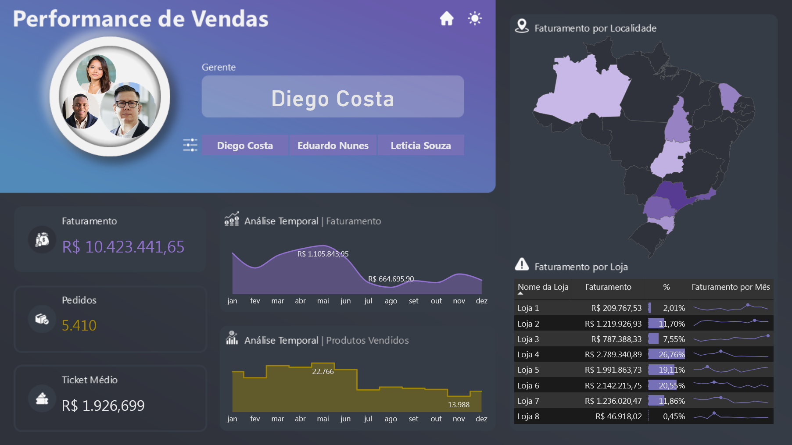

# 📊 Performance de Vendas — Zentronix Electronics

## 📌 Visão Geral

Este projeto apresenta um **dashboard analítico de performance de vendas**, desenvolvido em **Power BI**, com foco no acompanhamento de faturamento, volume de pedidos e comportamento de consumo por região.

A solução foi criada para a empresa fictícia **Zentronix Electronics**, permitindo analisar o desempenho comercial de lojas e gerentes regionais ao longo do tempo por meio de indicadores estratégicos e visualizações interativas.

🔎 [Projeto Interativo](https://app.powerbi.com/view?r=eyJrIjoiMWI3YTFhYzgtYTIwOS00ZDY5LWI0M2YtNGRiNzBhOGFlZGNjIiwidCI6IjIzY2FjN2VlLWYxZDgtNDMzOS1hYTdiLTc4MWFhOWY5MjI1YiJ9)

---

# 🧠 Contexto do Problema

A **Zentronix Electronics** buscava compreender melhor o desempenho comercial de suas operações.

Apesar da disponibilidade de dados de vendas, a empresa não possuía uma **visualização consolidada** que permitisse acompanhar:

- faturamento por loja  
- volume de pedidos  
- desempenho por gerente regional  
- comportamento de vendas ao longo do tempo

Essa limitação dificultava análises comparativas e a identificação de **oportunidades de crescimento e expansão comercial**.

---

# 🎯 Abordagem Estratégica

Foi desenvolvido um **dashboard analítico no Power BI** utilizando **modelagem dimensional estruturada**, permitindo consolidar indicadores estratégicos de vendas em uma única interface executiva.

A solução permite:

- selecionar gerentes responsáveis pelas operações
- analisar indicadores de faturamento e pedidos
- acompanhar a evolução mensal das vendas
- identificar sazonalidades e padrões de crescimento

Os principais **KPIs monitorados** são:

- **Faturamento Total**
- **Quantidade de Pedidos**
- **Ticket Médio**

A análise temporal de **12 meses** possibilita observar tendências de desempenho e identificar períodos de maior e menor volume de vendas.

---

# 📈 Impactos e Resultados

O dashboard permite:

- avaliar o desempenho comercial **por gerente**
- comparar resultados **entre lojas**
- identificar **regiões com maior faturamento**
- acompanhar a evolução das vendas ao longo do ano

A visualização geográfica do Brasil destaca **variações regionais de faturamento**, enquanto a tabela analítica permite detalhar:

- faturamento por loja
- participação percentual no faturamento total
- evolução mensal das vendas

Essa abordagem facilita a identificação de **lojas com maior potencial de crescimento** e regiões que demandam estratégias comerciais específicas.

---

# 🧩 Estrutura do Dashboard

## 🎨 Interface

O dashboard foi desenvolvido com **Dark Mode como padrão**, oferecendo melhor leitura visual para dashboards analíticos.

Também possui:

- ícone para alternar **Dark Mode / Light Mode**
- botão **"Analisar"** para abrir o dashboard
- ícone para **retornar à Home**

---

## 📊 Componentes do Painel

### 👤 Gerente Selecionado

No canto superior esquerdo do painel há um espaço dedicado a:

- exibir a **foto do gerente selecionado**
- filtro com os **nomes dos três gerentes regionais**
- ícone de navegação para **Home**
- botão de alternância **Dark / Light Mode**

---

### 📌 Indicadores Principais (Cards)

O painel apresenta três indicadores principais:

- **Faturamento Total**
- **Quantidade de Pedidos**
- **Ticket Médio**

Esses cartões oferecem uma visão rápida do desempenho geral das vendas.

---

### 📈 Performance do Faturamento

Gráfico de **área temporal** que apresenta:

- evolução do faturamento ao longo dos meses
- destaque para o **mês de maior faturamento**
- destaque para o **mês de menor faturamento**

Esse visual facilita identificar **sazonalidade de vendas**.

---

### 📦 Performance de Pedidos

Gráfico de **área** semelhante ao de faturamento, porém focado em:

- quantidade de pedidos
- evolução mensal do volume de vendas
- meses com maior e menor quantidade de pedidos

---

### 🗺️ Distribuição Geográfica do Faturamento

Mapa do Brasil demonstrando:

- faturamento por estado
- variação no **tom de cor conforme volume de vendas**

Isso permite identificar rapidamente **regiões com maior concentração de receita**.

---

### 🏬 Análise por Loja

Tabela analítica contendo:

- **Loja**
- **Faturamento**
- **Percentual do faturamento em relação ao total**
- **Minigráfico com evolução mensal do faturamento**

Esse visual permite comparar o desempenho entre lojas e identificar unidades com melhor performance.

---

# 🛠️ Stack Técnica

O projeto foi desenvolvido utilizando as seguintes tecnologias:

- **Power BI** — construção do dashboard e visualizações analíticas
- **DAX (Data Analysis Expressions)** — criação de medidas e cálculos analíticos
- **Modelagem Dimensional** — organização das tabelas de fatos e dimensões
- **Data Storytelling** — construção da narrativa analítica para suporte à decisão
- **Business Intelligence** — estruturação dos indicadores estratégicos

---

# 🧱 Modelagem de Dados

A estrutura de dados foi organizada seguindo princípios de **modelagem dimensional**.

### Tabelas Fato

- vendas
- pedidos

### Tabelas Dimensão

- lojas
- gerentes
- produtos
- calendário
- regiões

Essa estrutura garante **performance nas consultas e escalabilidade do modelo analítico**.

---

# 📸 Preview do Dashboard

## Documentação das Medidas

Para consultar a documentação das medidas deste projeto, suas fórmulas e descrições, acesse a [Documentação das Medidas](docs/medidas-documentacao.md).

# 👨‍💻 Autor

Projeto desenvolvido como parte do meu portfólio profissional em **Business Intelligence e Data Analytics**, destacando habilidades avançadas e aplicáveis a diversos cenários analíticos:

- Desenvolvimento de **dashboards executivos e painéis estratégicos**, focados em insights acionáveis e tomada de decisão baseada em dados  
- **Modelagem dimensional e relacional**, aplicando corretamente **cardinalidade, granularidade** e hierarquias entre tabelas para garantir consistência e integridade dos dados  
- **Transformação de dados com Power Query e Linguagem M**, criando pipelines eficientes, automatizados e auditáveis  
- Criação de **KPIs estratégicos e métricas customizadas em DAX**, para análise de performance e comparações confiáveis  
- **Integração de múltiplas fontes de dados** (Excel, SQL, APIs, arquivos planos), padronizando e validando informações críticas  
- **Data storytelling e visualizações interativas**, com cores, hierarquias, filtros e destaque de insights, para facilitar interpretação e engajamento do usuário  
- **Análises estatísticas e preditivas**, usando Python, R, regressões, teste de hipóteses, séries temporais e técnicas de Machine Learning para identificação de tendências e padrões  
- **Automatização e otimização de processos analíticos**, incluindo ETL, scripts e compressão de dados, garantindo performance e escalabilidade dos relatórios  
- **Documentação detalhada de medidas, tabelas, modelos e processos**, permitindo reprodutibilidade, transparência e governança dos dados  
- Aplicação de **boas práticas de engenharia de dados**, integrando análise, estatística, IA e visualização para soluções analíticas completas e confiáveis  
- Domínio completo de **Power BI, DAX, Power Query, Python e R**, com foco em performance, qualidade e entrega de insights estratégicos

---

  
**Portfólio de Business Intelligence & Data Analytics**  

| [LinkedIn](https://www.linkedin.com/in/rogério-clynton-ribeiro/) | [Portfólio](https://clyntonboss.github.io/) |

